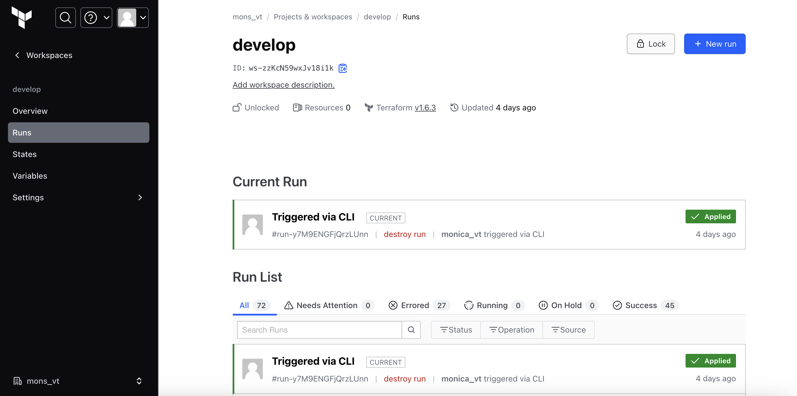

# LAB 2 and Lab 3 

This repository contains the Terraform modules that are used to provision s3 and EC2 resources as an alternative to using AWS SDK for python.

- Terraform Cloud is used to store the terraform state and the runs. Also, the AWS access keys are secured in the platform and we trigger the executions via CLI.

- We have included different AWS providers pointing out to different AWS regions.
- The resources included in the main.tf in the root folder are going to be provisioned by using the modules created in this repo. (structured this way for reusability).
- The following command will trigger the provisioning of the resources specified in the main.tf file; for Lab2, it will handle the creation of an s3 bucket and upload 2 files to another s3 bucket located in the Mumbai region. For Lab 3, it will create and EC2 instance, retrieve its state and then change its state to "stopped"
```
terraform init
terraform plan
terraform apply -auto-approve
```
- To delete the infrastructure, execute the following command:
```
terraform destroy
```
